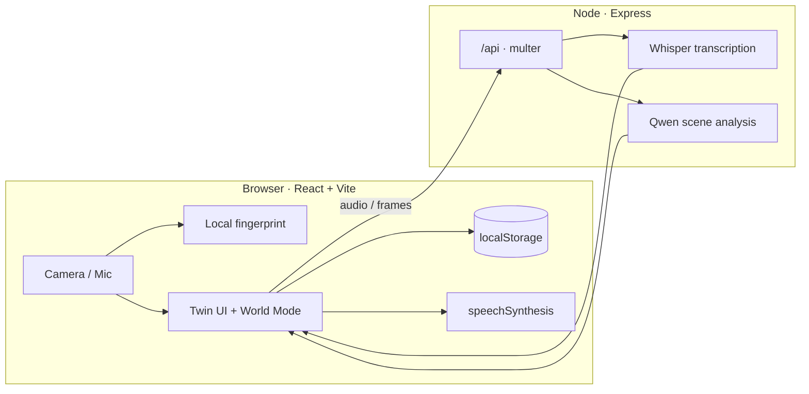

<div align="center">

# Kindred Objects

### Stateful conversational twins for the things that matter

[](https://openai.com)
[](https://react.dev)
[](https://www.typescriptlang.org)
[](https://vitejs.dev)
[](https://groq.com)
[](./LICENSE)

Point a phone camera at a meaningful household object.  
Give it a grounded personality.  
Preserve every confirmed change as an append-only history.

<br/>

**Privacy-first · Voice-native · Confirmation-gated · Care-aware**

</div>

---

## Why Kindred?

Everyday objects carry stories — a wedding photo, a favorite lamp, a set of keys that always go missing. Kindred Objects turns those items into **conversational twins**: stateful companions that remember what you told them, speak in first person, and only change when a human confirms it.

Built as a memory-support prototype for dementia-care contexts, with hard boundaries:

| Never does | Always does |
|---|---|
| Diagnose or give medical advice | Require confirmation for consequential changes |
| Decide medications or emergencies | Keep API keys server-side |
| Hide monitoring or persist raw frames | Store twins locally with export & delete |
| Invent events while the camera is off | Ground replies in approved profile + confirmed state |

---

## Features at a glance

```text
┌──────────────┐   ┌─────────────────┐   ┌──────────────────┐
│  Introduce   │ → │  Confirm twin   │ → │  Talk & update   │
│  with camera │   │  by voice/tap   │   │  with history    │
└──────────────┘   └─────────────────┘   └──────────────────┘
         │                                        │
         └──────────── World Mode ────────────────┘
              live multi-object scene understanding
```

- **Hands-free enrollment** — one question at a time, voice commands + keyboard fallback
- **Instant capture feedback** — spoken “Picture taken,” camera shutdown, auto-advance
- **Local visual fingerprints** — 48-bin color histograms; identity always confirmed by you
- **Typed state schemas** — sentimental items, appliances, and personal belongings
- **Append-only history** — caregiver corrections without rewriting the past
- **World Mode** — live scene graph, tap-to-talk Q&A, pause seeing / pause voice / exit
- **PWA-ready** — installable metadata + optional service worker in production
- **Groq-powered** — Whisper Large V3 Turbo transcription + Qwen vision reasoning

---

## Quick start

```bash
npm install
cp .env.example .env   # Windows: copy .env.example .env
# Add GROQ_API_KEY to .env
npm run dev
```

Open **http://localhost:5173**. Camera and microphone need `localhost` or HTTPS.

| Script | What it does |
|---|---|
| `npm run dev` | Vite client + Express API (port `8787`) via concurrently |
| `npm run build` | Typecheck + production client/server build |
| `npm start` | Serve the built app (`NODE_ENV=production`) |
| `npm test` | Vitest suite (state, confirmation, boundaries, matching) |
| `npm run lint` | Strict TypeScript checks for client and server |

The Vite proxy forwards `/api` to the local server so the Groq key **never** enters browser code.

### Environment

```env
GROQ_API_KEY=replace_with_your_server_side_key
GROQ_TRANSCRIPTION_MODEL=whisper-large-v3-turbo
GROQ_VISION_MODEL=qwen/qwen3.6-27b
PORT=8787
```

---

## Architecture



| Layer | Role |
|---|---|
| **Client** | Capture, fingerprinting, twin state machine, caregiver tools, TTS |
| **Server** | Transcription + vision only — no durable media storage |
| **Storage** | Twins, events, and consent live in the browser; export/delete anytime |

---

## Data flow

### Single-object introduction

1. Frame is sampled only after **Take picture**
2. Browser reduces it to a 48-value histogram, then discards the frame
3. App vibrates, says “Picture taken,” turns the camera off, advances
4. Similarity search proposes a twin → you confirm by voice or button
5. New objects get a guided voice interview once they can be put down
6. Spoken answers are recorded until silence, transcribed server-side, discarded
7. Accepted changes create immutable events and update current state

### World Mode

1. You explicitly start a visible World Mode session
2. Frames sample ~every 8s; unchanged scenes are skipped locally
3. Temporary compressed frames go through the server to Groq — not persisted
4. Scene graph updates known/unknown objects without mutating twin state
5. Tap-to-talk questions are transcribed, answered from the latest frame, spoken locally
6. Suggested state changes still require confirmation; pause & exit stay visible

---

## Object categories

| Category | Examples | Tracked state |
|---|---|---|
| **Sentimental** | Photos, keepsakes, gifts | condition · location · display |
| **Appliance** | Lamps, everyday tools | power · closure · condition |
| **Belonging** | Keys, glasses, bags | location · condition · completeness |

Each twin carries a persona (warmth, voice, greeting), approved instructions, safety notes, and medication-related flags that tighten confirmation rules.

---

## Verification

```bash
npm run lint
npm test
npm run build
npm audit
```

The suite covers state extraction, confirmation rules, corrections, medical boundaries, grounding, and fingerprint matching.

---

## Deploy

Ready for [Render](https://render.com) via `render.yaml`:

- Node 20 web service
- `npm ci && npm run build` → `npm start`
- Health check at `/api/health`
- Set `GROQ_API_KEY` in the dashboard (not committed)

---

## Prototype limits

> This is a **memory-support prototype**, not a medical device or autonomous safety system.

- It only knows what was shown or reported during a session
- It cannot infer events that occurred while the camera was off
- Visual matching is a histogram heuristic — not production re-identification
- World Mode model output can be wrong; persistent changes require human confirmation
- It must never replace human care or supervision

A production adapter should swap in multi-view visual embeddings while keeping the same ambiguity and confirmation policy.

---

## Stack

| Area | Choice |
|---|---|
| UI | React 19 · TypeScript · Vite 6 · Lucide |
| API | Express 5 · Multer · Zod |
| Models | Groq Whisper Large V3 Turbo · Qwen 3.6 vision |
| Voice out | Browser `speechSynthesis` |
| Tests | Vitest |
| Deploy | Render Blueprint |

---

## License

MIT © [Yaphet Lemiesa](https://github.com/ylemiesa57)

---

<div align="center">

**Objects remember. People confirm. Care stays human.**

<br/>

<em>Submission to the OpenAI Hackathon</em>

</div>
